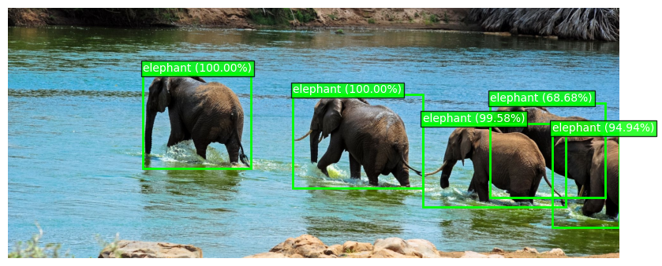

# 🐾 Wildlife Vision Pipeline

**End-to-End Animal Detection and Classification System**



---

## 📌 Overview

This project implements a **two-stage computer vision pipeline** for wildlife recognition using camera trap imagery:

1. **Object Detection** – detects animals using a pre-trained detector (MegaDetector)
2. **Species Classification** – classifies each detected animal from cropped regions using a custom-trained CNN

The system reflects a **real-world ML workflow**, where detection and classification are decoupled and connected through a structured data pipeline.

---

## 🎯 Motivation

Wildlife datasets present real-world challenges:

* Multiple animals per image
* Incomplete or ambiguous annotations
* Complex backgrounds and lighting
* Partial visibility of animals

This project focuses on building a **robust and reproducible pipeline under imperfect data conditions**, prioritizing:

* data quality
* pipeline consistency
* controlled experimentation

---

## 🧠 Architecture

```text
Snapshot Serengeti Metadata (images + annotations)
    ↓
[ prepare_training_manifest.py ]
    ↓
Filtered Manifest (URLs + species labels)
    ↓
[ prepare_training_data.py ]
    ↓
Downloaded Images → Detection (MegaDetector) → Cropping
    ↓
Class-organized Cropped Dataset
    ↓
[ train_classifier.py ]
    ↓
Trained Classification Model
    ↓
[ detect.py ]
    ↓
Inference on New Images (Detection + Classification)
```

### Pipeline Description

1. **Manifest Creation (`prepare_training_manifest.py`)**
   Processes raw metadata from the Snapshot Serengeti dataset and extracts a clean, structured list of:

   * image URLs
   * corresponding species labels

   👉 Output: simplified JSON manifest used as a single source of truth for dataset creation

---

2. **Data Preparation (`prepare_training_data.py`)**
   For each entry in the manifest:

   * downloads the image
   * runs MegaDetector to detect animals
   * crops detected regions with padding
   * saves crops into class-specific directories

   👉 Output: structured dataset of cropped animal images

---

3. **Model Training (`train_classifier.py`)**
   Trains a CNN classifier on the cropped dataset:

   * uses transfer learning (e.g. MobileNetV2)
   * applies augmentation (training only)
   * handles class balancing

   👉 Output: trained classification model

---

4. **Inference (`detect.py`)**
   Runs the full pipeline on new images:

   * detects animals
   * crops detected regions
   * classifies each crop
   * returns labeled bounding boxes

   👉 Output: image with detected and classified animals

---

📌 This design mirrors a real-world system where:

* raw data ingestion is separated from training
* detection and classification are decoupled
* dataset creation is reproducible and controlled


---

## 🖼️ Example Outputs


---

## 🗂️ Project Structure

```text
.
├── scripts/
│   ├── detect.py
│   ├── prepare_training_data.py
│   ├── prepare_training_manifest.py
│   ├── train_classifier.py
│
├── src/
│   ├── classification/
│   ├── detection/
│   ├── data/
│   ├── utils/
│   ├── config.py
│   └── __init__.py
│
├── models/
├── data/
├── outputs/
├── requirements.txt
└── README.md
```

---

## ⚙️ Key Features

* ✅ Two-stage pipeline (detection → classification)
* ✅ Integration with MegaDetector (real-world detection model)
* ✅ Custom crop + padding strategy
* ✅ Manifest-driven dataset
* ✅ Explicit dataset balancing strategy
* ✅ Transfer learning (MobileNetV2 / ResNet50)
* ✅ Reproducible training setup

---

## 🧪 Dataset Pipeline

### Step 1: Detection-based Data Extraction

Training data is not used directly from raw images.

Instead:

* MegaDetector is used to detect animals
* Detected regions are cropped
* Crops become inputs for the classifier

👉 This simulates real-world usage where classification depends on detection quality.

---

### Step 2: Label Filtering

Due to dataset limitations:

* Only images with **single-species annotations** are used
* Multi-animal images are excluded

👉 This ensures label correctness despite imperfect annotations.

---

### Step 3: Dataset Balancing (Key Design Decision)

To ensure fair and stable training:

* Only classes with **at least 500 samples** are kept
* All classes are **downsampled to exactly 500 samples**

👉 Result:

* perfectly balanced dataset
* controlled training conditions
* reduced class bias

📌 This is a deliberate trade-off:

* less data overall
* but significantly improved training stability

---

## 📊 Evaluation

### Classification Performance

* **Validation Accuracy:** ~88.2%
* **Training Accuracy:** ~97–98%
* **Validation Loss:** ~0.48

### Training Strategy

* Phase 1: Train classifier head
* Phase 2: Fine-tune top layers
* Learning rate scheduling (`ReduceLROnPlateau`)

---

### ⚠️ Real-World Performance Note

Despite strong validation metrics:

* predictions can degrade in full pipeline usage
* performance depends heavily on crop quality
* model may show bias toward visually dominant classes

👉 This reflects a common real-world issue:

> Good offline metrics do not always translate to robust end-to-end performance.

---

## 🚀 Pipeline Usage

```bash
python scripts/prepare_training_manifest.py
python scripts/prepare_training_data.py
python scripts/train_classifier.py
python scripts/detect.py
```

---

## 🔁 Reproducibility

* Dependencies locked via `requirements.txt`
* Random seeds set (Python, NumPy, TensorFlow)
* Dataset defined via manifest
* Class mappings stored and reused